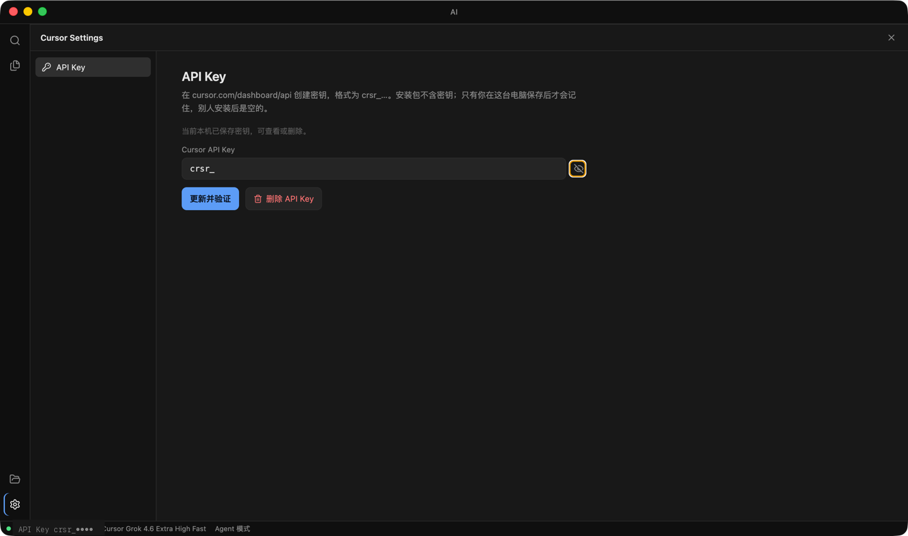
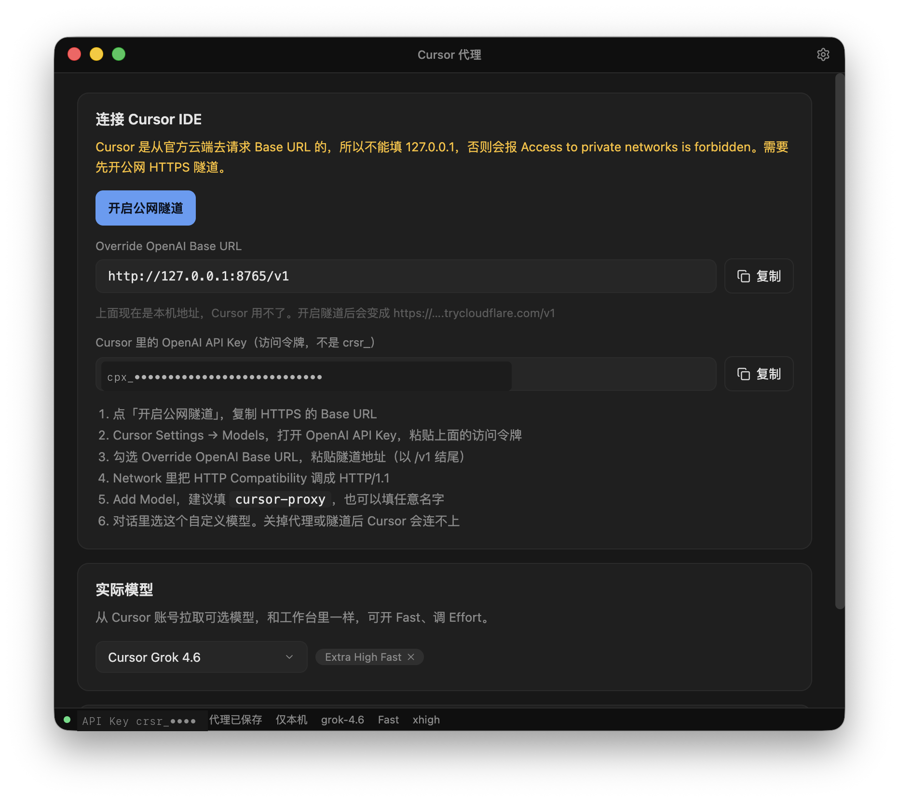

# Cursor 本地工具

本仓库包含两个独立的桌面程序，都使用你在 [Cursor Dashboard](https://cursor.com/dashboard/api) 创建的 `crsr_…` 密钥，走官方 `@cursor/sdk`。

| 程序 | 目录 | 作用 |
| --- | --- | --- |
| **Cursor 工作台** | [`cursor-api`](cursor-api) | 独立窗口：文件树、编辑器、Agent 对话，可在工作区里读文件、改文件、跑命令 |
| **Cursor 代理** | [`cursor-proxy`](cursor-proxy) | 把本机模型转成 OpenAI 兼容接口，供 Cursor IDE 通过自定义 Base URL 调用 |

密钥只保存在本机（`~/.cursor-ui/`），不会进仓库。

环境要求：Node.js **22.13+**（目录内 `.nvmrc` 为 `22.22.1`）。

---

## Cursor 工作台



首次打开在设置里粘贴 Cursor API Key（安装包不含密钥，只保存在本机）。之后是左边资源管理器、中间编辑器 / Review、右边 Agent 对话。计费与 Cursor IDE 里的 Agent 相同。

**能做什么**

- 打开本地文件夹当工作区，浏览、搜索、编辑文件
- 右侧多标签对话，Agent 可读写工作区并执行命令；Plan 模式偏方案
- 改文件后可 Review 对照，Keep / Undo 接受或撤回
- 把左侧文件拖进输入框当上下文

**启动**

```bash
cd cursor-api
source ~/.nvm/nvm.sh && nvm use
npm install
npm run desktop
```

浏览器开发：`npm run dev:web`，打开 http://127.0.0.1:5173（只监听本机）。

`⌘/Ctrl + ,` 打开设置，`⌘/Ctrl + O` 打开文件夹。

打包：`npm run dist:mac` / `npm run dist:win`，产物在 `release/`。

更细的说明见 [cursor-api/README.md](cursor-api/README.md)。

---

## Cursor 代理



把 Dashboard 的 `crsr_…` 包成 OpenAI 的 `/v1/chat/completions`，让 **Cursor IDE** 走「自定义 OpenAI 地址」调用。真正用哪家模型、Fast / Effort 在这个窗口里选；IDE 里的模型名可以随便起。

**注意**

- Cursor 的请求从官方云端发出，**不能**填 `http://127.0.0.1:8765/v1`，否则会报 `Access to private networks is forbidden`。需要先开公网 HTTPS 隧道（本机安装 `cloudflared`：`brew install cloudflared`）。
- 代理只做纯文本，关掉了 SDK 工具，不会改你的项目文件。
- 对话里请用 **Plan**，不要用 ∞ Agent。关掉代理或隧道后，IDE 会连不上。

**启动**

```bash
cd cursor-proxy
source ~/.nvm/nvm.sh && nvm use
npm install
npm run desktop
```

窗口里点「开启公网隧道」，把 HTTPS Base URL 和访问令牌（`cpx_…`，不是 `crsr_`）填进 Cursor Settings → Models。HTTP Compatibility 选 HTTP/1.1。

更细的说明见 [cursor-proxy/README.md](cursor-proxy/README.md)。

---

## 不提交的内容

`node_modules`、`dist`、`electron-dist`、`release` 安装包、`.env` 均已忽略。每人在自己电脑填写 API Key。
